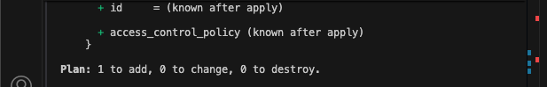
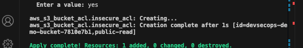
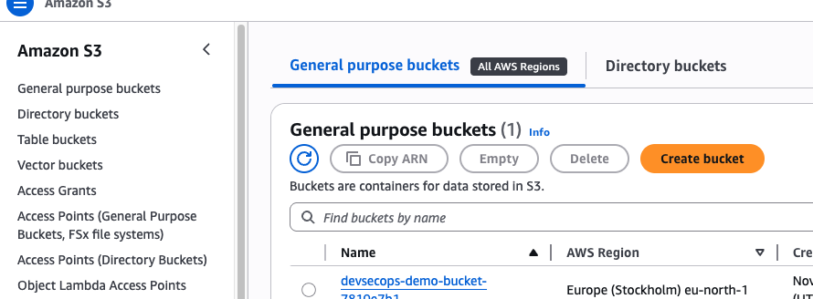
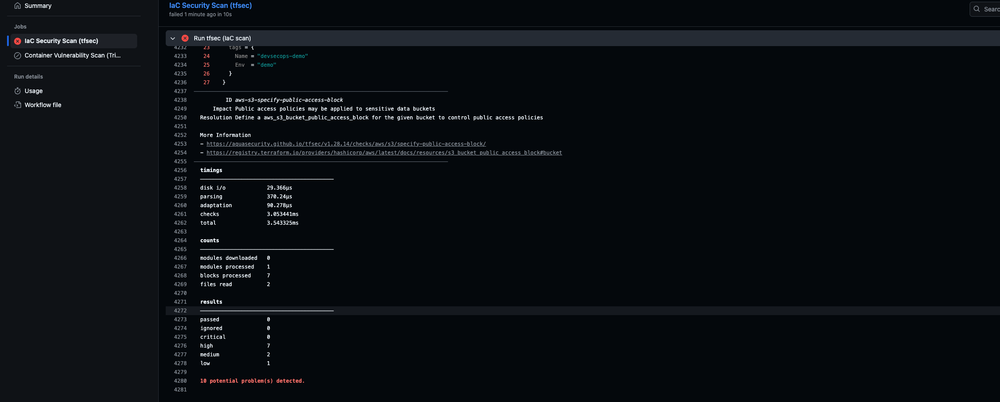

# DevSecOps Security Automation for Terraform & Containers

## Project Overview
This project demonstrates **automated security enforcement** for both Terraform infrastructure and container images using **GitHub Actions**. Every push or pull request triggers:

 * tfsec — scans Terraform for misconfigurations  
 * Trivy — scans Docker image for vulnerabilities  

The CI pipeline **fails automatically** if security risks are detected enforcing DevSecOps “shift left” principles.

⚠️ This project is for learning. The initial state contains insecure settings on purpose.
---

## Architecture

**Flow:**
1. Developer pushes Terraform and app changes to GitHub.
2. GitHub Actions runs Terraform security scan using tfsec.
3. If IaC is secure → Docker image is built and scanned using Trivy.
4. Vulnerabilities are reported and surfaced in GitHub Security tab.
5. Code is only merged if both security scans are clean.

---

## Screenshots

### 1. Terraform Plan
Initial infrastructure provisioning plan.

---

### 2. Terraform Apply
Terraform applies changes to AWS and creates the S3 bucket.

---

### 3. AWS S3 Bucket
The demo S3 bucket created using Terraform (initially insecure for testing).

---

### 4. tfsec Scan Results
tfsec detects **HIGH/MEDIUM** security issues in Terraform configuration.

---

### 5. GitHub Actions Security Scan
Pipeline fails based on security gates — catching misconfigurations early.

---

## How It Works

1. **Terraform deploys AWS S3 bucket** used by the sample application.
2. **tfsec** automatically scans `.tf` files for security issues:
   - Public access exposure
   - Lack of encryption
   - Missing bucket policy controls
3. If vulnerabilities exist →  Pipeline fails to protect infrastructure.
4. After fixing misconfigurations →  tfsec passes and Trivy runs.
5. **Trivy scans Docker image** for HIGH/CRITICAL vulnerabilities.
6. Only when **both scans pass** is the pipeline allowed to continue.

---

---

## How We Overcame the Security Issues

tfsec reported several security misconfigurations in the Terraform S3 bucket setup. To resolve these issues and ensure secure infrastructure deployment, we applied the following improvements:

1. **Removed public access**  
   Public ACLs and policies that exposed the bucket to the internet were removed.

2. **Enabled S3 Public Access Block**  
   This prevents the bucket from ever being made public again by mistake.

3. **Enabled default encryption**  
   All objects stored inside S3 are now encrypted using server-side encryption (SSE).

4. **Enforced HTTPS-only data transfer**  
   A bucket policy blocks any unencrypted (HTTP) requests to the bucket.

5. **Enabled versioning**  
   Protects against accidental or malicious file deletions or overwrites.

6. **Least privilege bucket access**  
   Access permissions were restricted so only necessary AWS identities can interact with the bucket.

7. **Verified changes through tfsec scan**  
   After making these changes, tfsec reported **no remaining MEDIUM/HIGH/CRITICAL** issues in the Terraform code 

---

 The pipeline now passes successfully  
 Infrastructure deployments are secure by default

 ---

##  What We Can Learn from This Project

This project showcases how DevSecOps improves cloud security by shifting security checks to the earliest stages of development. Key learnings include:

### DevSecOps in Action
- Security is **automated**, not manual
- Infrastructure cannot be deployed unless secure
- Vulnerabilities are caught during development, not after deployment

### Terraform Security Best Practices
- Avoid public exposure of cloud resources
- Enforce encryption to protect data at rest
- Require secure (HTTPS-only) access for communication
- Ensure versioning to prevent data loss
- Use least-privilege IAM policies

### GitHub Actions CI/CD Integration
- Automated pipelines reduce human error
- Security scans run on every push and pull request
- Helps maintain compliance and governance standards

---

 Final Takeaway  
> DevSecOps ensures that **security and automation go hand-in-hand** — preventing breaches BEFORE anything hits production.

